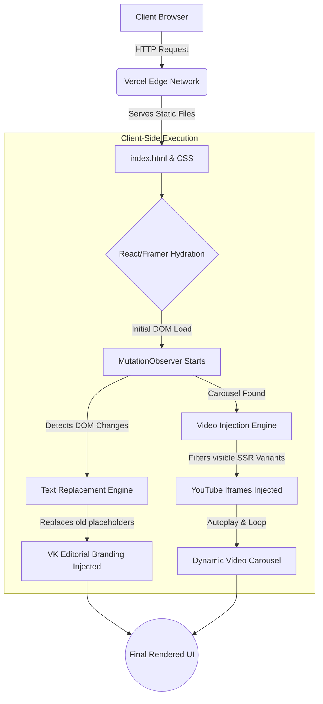

# VK Editorial Agency - Portfolio Website 🎬

A high-performance, responsive, and ultra-dynamic portfolio website custom-built for **VK Editorial Agency**. This project showcases premium video editing, motion graphics, VFX, SFX, and 3D Blender services. 

<div align="center">
  
  
  
</div>

---

## 👨‍💻 About The Developer
**Developed by:** [Vikash Kumar](https://github.com/vikashkumar302004)  
I am a freelance software developer, and this repository contains the finalized and highly optimized codebase developed as a freelance project for **VK Editorial Agency**. 

---

## 🛠️ Tech Stack Used

- **UI & Layout:** Framer (Static DOM Generation)
- **Styling:** Vanilla CSS, CSS Flexbox/Grid, Dynamic CSS Variables (`var(--21h8s6)`)
- **Logic & Scripting:** Vanilla JavaScript (ES6+), DOM Manipulation, MutationObservers
- **Media Delivery:** YouTube Iframe API (Optimized lazy loading for heavy videos)
- **Deployment:** Vercel

---

## 🏗️ System Architecture & DOM Flow

Below is the technical flowchart demonstrating how the static site hydrates and dynamically updates the DOM to ensure optimal performance without layout shifting:



---

## ⚡ Features & Optimizations
1. **Dynamic Text Replacement:** Uses `MutationObserver` to intercept DOM node additions and instantly rebrand placeholders to "VK Editorial" without any visible lag or CPU throttling.
2. **Responsive Video Carousel Fix:** Intelligently scans multiple SSR (Server-Side Rendering) variants generated by Framer, filtering out hidden breakpoints to prevent dual-video rendering or audio overlap bugs.
3. **Optimized Asset Loading:** Heavy assets like `ffmpeg.zip` and large `.mp4` files are explicitly `.gitignore`'d and `.vercelignore`'d, strictly keeping the repository under GitHub's 100MB limits.
4. **Custom CSS Overrides:** Global injection of the custom "Ocean Blue" theme (`#0ea5e9`) applied seamlessly to SVG elements and deep-nested UI components.

---

## 🚀 How to Run Locally

If you want to view or test this project on your local machine, follow these steps:

### 1. Clone the Repository
```bash
git clone https://github.com/vikashkumar302004/vikrant-portfolio.git
cd vikrant-portfolio
```

### 2. Run a Local Server
Since this is a vanilla JS/HTML project, you can use `serve` to host it locally without a complex build pipeline.

```bash
# If you don't have 'serve' installed, npx will download it automatically
npx serve .
```

### 3. View in Browser
Open your browser and navigate to:  
👉 **`http://localhost:3000`**

*(Note: Always perform a Hard Refresh `Ctrl + Shift + R` to bypass cached versions of the `index.html` after modifying the JS).*

---

## 🤝 Contribution
- **Sole Contributor:** [vikashkumar302004](https://github.com/vikashkumar302004)

> *"Building scalable, high-conversion interfaces for modern agencies."*
