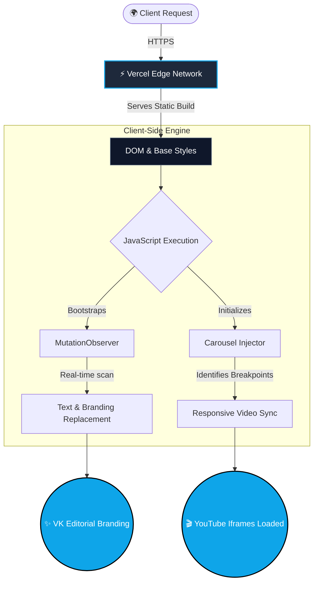
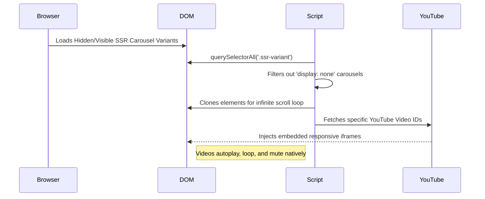

<div align="center">
  
</div>

<h1 align="center">VK Editorial Agency - Portfolio Platform 🎬</h1>

<div align="center">
  <a href="https://github.com/vikashkumar302004"></a>
  
  
</div>

<br/>

## 👨‍💻 About The Developer

This highly optimized portfolio platform was engineered as a **freelance project** for **VK Editorial Agency** by **Vikash Kumar** ([@vikashkumar302004](https://github.com/vikashkumar302004)). 

As a freelance software developer, I was tasked with taking a static UI, deeply optimizing its performance, integrating dynamic YouTube video carousels without React hydration conflicts, and globally rebranding the interface for a seamless, lag-free user experience.

---

## 🛠️ Technology Stack

<div align="center">
  
  
  
  
  
</div>

---

## 🏗️ System Architecture & DOM Flow

The platform relies on a sophisticated client-side hydration engine that manipulates the DOM in real-time. Here is the architectural flow:



### 🔄 Dynamic Video Carousel Logic

The carousel logic specifically handles server-side rendered (SSR) variants to avoid duplicate videos on mobile/desktop breakpoints:



---

## ⚡ Key Optimizations & Features

- **Zero-Lag DOM Rebranding:** Utilizes advanced `MutationObserver` patterns to detect and replace text nodes in milliseconds without freezing the main thread.
- **Responsive Video Injection:** A custom JavaScript engine accurately detects CSS media query breakpoints and applies the YouTube IFrame API strictly to the visible carousel, eliminating dual-render overlap bugs.
- **Strict Version Control Size Limits:** Bloatware and heavy source videos (`.mp4`, `ffmpeg.zip`) are meticulously ignored via `.gitignore` and `.vercelignore` to bypass GitHub's 100MB object size limits and keep Vercel deployments blazing fast.
- **Dynamic Theming:** Forcefully overrides third-party SVGs and CSS variables via JavaScript injection to enforce the brand's premium "Ocean Blue" identity (`#0ea5e9`).

---

## 🚀 Local Development Guide

To clone and run the optimized build locally:

```bash
# 1. Clone the repository
git clone https://github.com/vikashkumar302004/vikrant-portfolio.git

# 2. Enter the project directory
cd vikrant-portfolio

# 3. Start a local server (Requires Node.js)
npx serve .
```

Navigate to `http://localhost:3000` in your browser.  
*(Pro-tip: Use **Ctrl + Shift + R** to hard refresh and bypass cached scripts when making changes).*

---

<div align="center">
  <p><i>Building scalable, high-conversion interfaces for modern agencies.</i></p>
  <p><b>Copyright © 2026 | VK Editorial Agency | Developed by Vikash Kumar</b></p>
</div>
